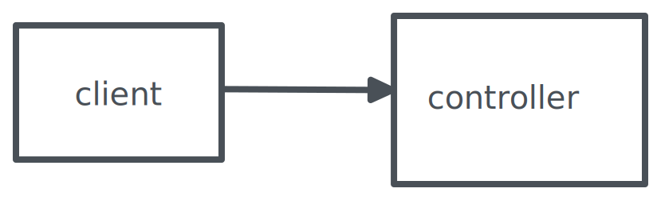
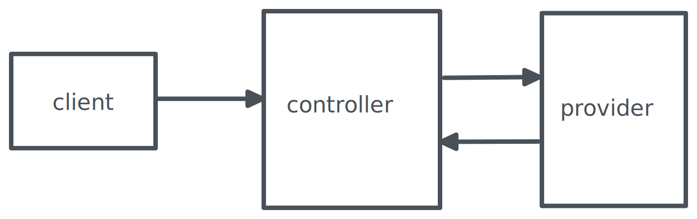
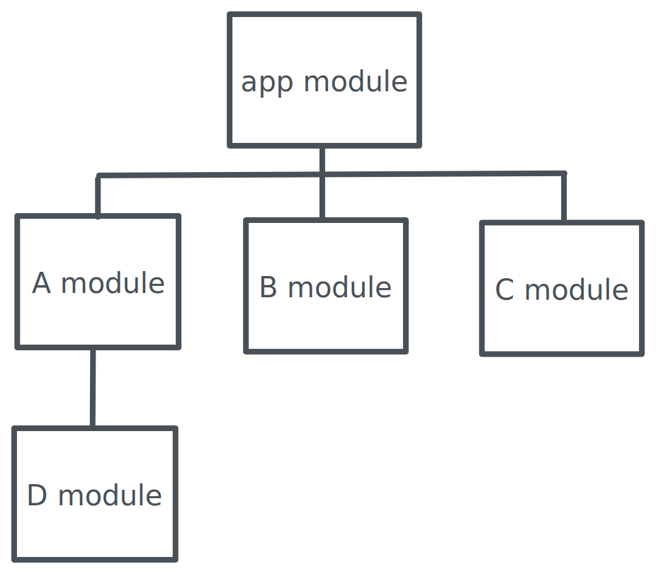
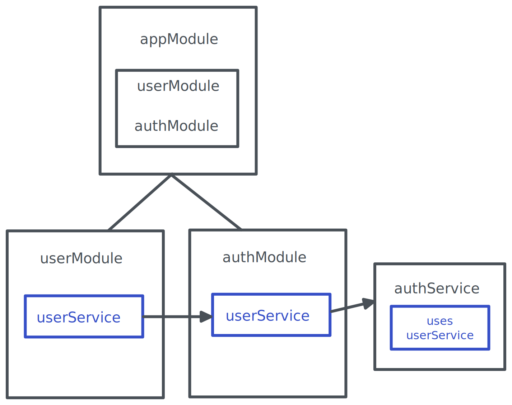

회사에서 스터디를 할 때 주로 클린 코드나 아키텍쳐에 대해서 스터디를 하곤 하는데, 아키텍쳐 관련 스터디를 할 때 마다 서비스, 모듈, 의존성 주입 등 생소한 용어로 인해 개인적인 스터디의 효율이 떨어지는 것을 느꼈습니다.<br><br>
마침 개인 프로젝트로 서버 구축이 필요하기도 하여 겸사겸사 익숙한 javascript로 시작할 수 있는 nest.js라는 서버 프레임워크를 통해 용어 정리와 사용법을 익혀볼 예정입니다.<br>

## Controllers

<br>
controller는 client의 요청을 받고, 응답을 다시 client에게 반환합니다.<br>
하나 이상의 route를 가지며 각각 다른 action을 수행합니다.<br>
class와 decorator를 통해 controller를 만들 수 있습니다.<br>

터미널에서 nest cli 설치 후, <code>nest g controller <controller_name></code>,
또는 <code>nest g co <controller_name></code>을 통해서 손쉽게 controller 파일을 생성할 수 있습니다.<br>

```
import { Controller, Get } from '@nestjs/common';

@Controller('cats')
export class CatsController {
  @Get()
  findAll(): string {
    return 'This action returns all cats';
  }
}

```

controller 클래스의 상단에 @Controller decorator에 'users'를 명시해서 /users path로 들어오는 요청을 받도록 합니다.<br>

Get decorator를 사용하면 해당 엔드포인트에 대한 요청을 위한 핸들러를 만들 것을 nest에게 말해줄 수 있습니다. 괄호 내부에 특정한 path를 써서 해당 엔드포인트로 요청할 수 있도록 합니다. @Get('profile')이라고 사용한다면, /cats/profile 에 대한 요청을 처리할 수 있습니다.<br>

이처럼 nest에서 controller는 요청이 알맞은 핸들러에서 처리될 수 있도록 라우팅해주는 역할을 합니다.<br>

## Providers

<br>
provider는 의존성으로 주입될 수 있는 클래스를 뜻합니다.<br>
services, repositories, factories, helpers 등과 같은 nest의 class들을 provider라고 할 수 있습니다.<br>
controller가 HTTP 요청을 알맞은 핸들러에서 처리할 수 있도록 했다면, 좀 더 복잡한 task는 provider가 수행하게 됩니다.<br>

provider는 터미널에서 <code>nest g service <service_name></code>,
또는 <code>nest g s <service_name></code> 명령어로 생성할 수 있습니다.<br>

```
import { Injectable } from '@nestjs/common';
import { Cat } from './interfaces/cat.interface';

@Injectable()
export class CatsService {
  private readonly cats: Cat[] = [];

  create(cat: Cat) {
    this.cats.push(cat);
  }

  findAll(): Cat[] {
    return this.cats;
  }
}
```

@Injectable() decorator가 하는 일은 Nest IoC(Inversion of Control) container로 CatsService라는 클래스가 디펜던시로 주입될 수 있도록 합니다.<br>

## Modules

<br>
어플리케이션의 구조를 정리해주는 metadata를 제공합니다.<br>

```
import { Module } from '@nestjs/common';

@Module({
  controllers: [],
  providers: [],
  imports: [],
  exports: [],
})
export class CatsModule {}
```

- controllers: 생성되어야 하는 controllers
- providers: 모듈 내에서 inject되어 사용될 수 있는 클래스
- imports: 모듈 내에서 사용할 수 있도록 import되어진 providers
- exports: 다른 모듈에서 사용할 수 있도록 export하고자 하는 providers

위의 프로퍼티를 통해 모듈과 모듈 사이에 어떤 provider들이 제공되고 쓰이는지 알 수 있습니다.<br>

### 예시

<br>
다음 코드는 모듈의 구성과 의존성 주입에 대한 간단한 예시입니다.<br>

```
// user.module.ts
import { Module } from '@nestjs/common';
import { UserService } from './users.service';
import { UserController } from './users.controller';

@Module({
  providers: [UserService],
  exports: [UserService],
  controllers: [UserController],
})
export class UserModule {}
```

일단 사용자에 대한 모듈을 만들고 controllers에는 요청을 받는 UserController, providers에는 컨트롤러에서 받은 요청을 처리하는 UserService를 명시했습니다.<br>

UserService provider는 또 다른 모듈인 auth module에서 사용될 수 있도록 exports 내부에 사용하였습니다.<br>

```
// auth.module.ts
import { Module } from '@nestjs/common';
import { UserModule } from './../users/users.module';
import { AuthService } from './auth.service';

@Module({
  imports: [UserModule],
  providers: [AuthService],
})
export class AuthModule {}
```

user module을 import하고, authService내부에서 UserService를 사용할 수 있습니다.<br>

### 참고자료

[nestJS](https://docs.nestjs.com/)<br>
