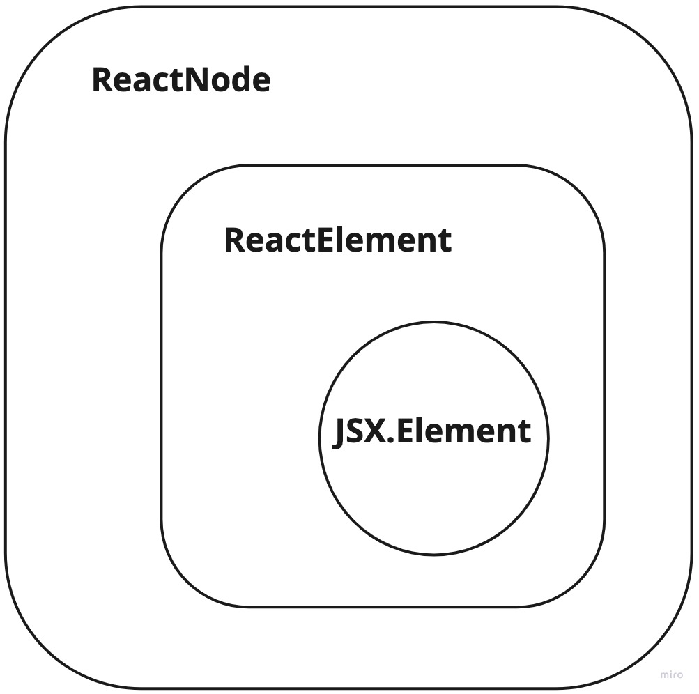

<br>

# ReactElement

먼저 ReactElement는 type, props, key 값을 갖는 객체입니다.<br>

```typescript
type Key = string | number;

interface ReactElement<
  P = any,
  T extends string | JSXElementConstructor<any> = string | JSXElementConstructor<any>
> {
  type: T;
  props: P;
  key: Key | null;
}
```

ReactElement의 generic parameter에는 P, T 값이 올 수 있습니다.<br>
P = any 는 generic의 paramter default값으로 generic으로 명시하지 않으면 P는 any 타입이 됩니다.<br>
T의 타입은 string | JSXElementConstructor<any>를 extend하고, default type 또한 동일합니다.<br>

# ReactNode

ReactNode는 ReactElement를 포함하는 더 넓은 범위의 타입입니다.<br>
ReactElement, ReactFragment, string, number, ReactNode 배열, null, undefined, boolean 타입이 될 수 있습니다.<br>

```typescript
type ReactText = string | number;
type ReactChild = ReactElement | ReactText;

interface ReactNodeArray extends Array<ReactNode> {}
type ReactFragment = {} | ReactNodeArray;

type ReactNode = ReactChild | ReactFragment | ReactPortal | boolean | null | undefined;
```

ReactElement 뿐만 아니라, boolean, null, undefined의 값까지 허용하는 타입이므로 ReactElement 타입보다 더 넓습니다.<br>

# JSX.Element

JSX.Element는 props가 generic이고 type이 any인 프로퍼티를 갖는 ReactElement입니다.<br>

```typescript
declare global {
  namespace JSX {
    interface Element extends React.ReactElement<any, any> {}
  }
}
```

### 참고자료

[typescript - Generic parameter defaults](https://www.typescriptlang.org/docs/handbook/release-notes/typescript-2-3.html#generic-parameter-defaults)<br>
[Allow skipping some generics when calling a function with multiple generics - Generic parameter defaults](https://github.com/microsoft/TypeScript/issues/10571)
