## 워크샵을 참여한 이유

AWS를 사용해본 적이 없는 사람들을 대상으로 하는 AWS 워크샵에 참여했습니다. 
어느날 회사에 잡담을 하는 채널에 초보자들을 대상으로 진행하는 AWS 워크샵 링크가 올라왔습니다. 책이나 강의로만 네트워크를 공부했던지라 워크샵이라는 새로운 방법으로 실습 참여를 해보고 싶다는 생각도 들었고, 언젠가는 프론트엔드 프로젝트 환경을 온전히 세팅해보고 싶다는 생각에 참여를 하게 되었습니다. 

# 사용한 AWS 서비스

- API Gateway
- DynamoDB
- AWS Lambda

### 서버리스란?

- 민첩성: 비즈니스 아이디어만 있으면 빠르게 서비스를 만들 수 있습니다.
- 성능: 자동으로 확장 축소합니다.
- 비용: 사용한 만큼만 비용을 지불합니다.
- 보안: 서버 관리를 위해 직접 접근하지 않습니다.

### 코어 서비스 구성

- 네트워크
- 웹 서버
- 로드 밸런서
- IAM

### 용어 정리

- VPN(Virtual Private Network)
- VPC(Virtual Private Cloud)
- 서브넷
- CIDR
- 라우팅 테이블
- 방화벽
- 가용 영역
- AMI

### 후기

여러가지 네트워크에 대한 생소한 개념들도 쉽게 설명해주셔서 네트워크에 대한 개념이 더 와닿았고, 이해하기가 쉬웠습니다.

### 참고자료

- [실습워크샵 링크](https://catalog.us-east-1.prod.workshops.aws/workshops/600420b7-5c4c-498f-9b80-bc7798963ba3/ko-KR/serverless) 
- [워크샵 다시보기](https://kr-resources.awscloud.com/aws-builders-korea-program) 
