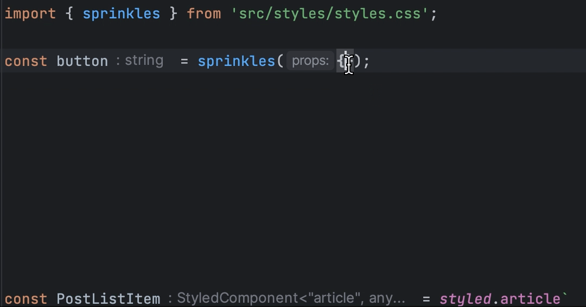
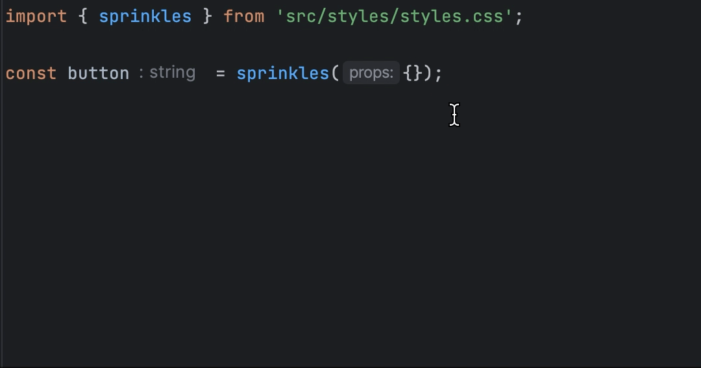

## vanilla-extract의 특징
- 제로 런타임
- type-safe하게 스타일링
- utility-first 방식의 스타일링

## type-safe
직접 css를 작성한다고 할 때 type-safe를 지원한다면 다음과 같은 실수를 줄일 수 있습니다.<br />
다음은 `vanilla-exteact` 공식 문서에서 가장 처음으로 발견한 예시입니다.<br />

```js
// styles.css.ts
import { createTheme, style } from '@vanilla-extract/css';

export const [themeClass, vars] = createTheme({
  color: {
    brand: 'blue',
    white: '#fff'
  },
  space: {
    small: '4px',
    medium: '8px',
  }
});

export const hero = style({
// brandd를 참조할 때 빨간색 밑줄로 타입 에러가 발생함
  backgroundColor: vars.color.brandd,
  color: vars.color.white,
  padding: vars.space.large
});
```

theme에 대한 타입을 따로 지정 해주지 않아도 잘못된 property를 참조했을 때, ide를 통해 type error가 발생하는 것을 알 수 있습니다.<br />

## vanilla-extract APIs

### Sprinkles
> Generate a static set of custom utility classes and compose them either statically at build time, or dynamically at runtime,
> without the usual style generation overhead of CSS-in-JS.

정적 스타일을 빌드 타임, 동적 스타일을 런타임에 **오버헤드 없이** 생성할 수 있습니다.<br />
`styled-components`와 같은 보편적인 CSS-in-JS에 비해 오버헤드가 없다.<br />
`utility class + type-safe` 한 스타일을 생성한다는 특징이 있습니다.

#### Usage
```js
import {
  defineProperties,
  createSprinkles
} from '@vanilla-extract/sprinkles';

const spacings = {
  'spacing-01': 2,
  'spacing-02': 4,
  'spacing-03': 8,
  // ...
};

const colors = {
  'primary-10': '#edf5ff',
  'primary-20': '#d0e2ff',
  'primary-30': '#a6c8ff',
  // ...
};

const spacingProperties = defineProperties({
  properties: {
    padding: spacings,
    paddingTop: spacings,
    paddingBottom: spacings,
    paddingLeft: spacings,
    paddingRight: spacings,
  },
});

const colorProperties = defineProperties({
  properties: {
    color: colors,
    background: colors
  }
});
export const sprinkles = createSprinkles(
  spacingProperties,
  colorProperties
);

export type Sprinkles = Parameters<typeof sprinkles>[0];
```

`conditions`, `defaultCondition`, `properties`를 인자로 받아 sprinkle을 생성합니다.<br />
생성된 sprinkle을 다음과 같이 사용할 수 있습니다.

```js
import { sprinkles } from 'src/styles/styles.css';

const button = sprinkles({
  color: 'primary-50',
  background: 'primary-10'
});
```
<br>

아래와 같이 스타일을 지정할 때 다음과 같이 자동완성을 지원합니다.<br/>




아래와 같이 정의하지 않은 스타일 값을 입력하면 type check에서 걸리게 됩니다.<br/>


### Recipes
recipe는 type-safe하게 multi-variant 스타일을 정의할 수 있습니다.
recipe에는 `base`, `variants`, `compoundVariants` 그리고 `defaultVariants를` 설정할 수 있습니다.
- `base`: variant에 상관없이 공통적으로 적용되는 스타일.
- `variants`: variant에 따라 적용되는 스타일.
- `compoundVariants`: variant 조합에 따라 적용되는 스타일.
- `defaultVariants`: variant의 기본값을 설정할 때 사용.

### variants
디자인 시스템에 여러 상황에 따라 스타일이 다른 버튼이 있다고 가정해봅시다.<br>
다음과 같이 한가지 케이스마다 하나의 스타일을 정의할 수 있습니다.

```js
import { recipe } from '@vanilla-extract/recipes';

export const button = recipe({
  base: {
    borderRadius: 6
  },
  variants: {
    color: {
      primary: { background: 'whitesmoke' },
      secondary: { background: 'blueviolet' },
      warning: { background: 'slateblue' }
    },
    fontWeight: {
      normal: { fontWeight: 400 },
      bold: { fontWeight: 700 }
    }
  },
});
```
위와 같이 정의하면 필요에 따라 다른 variant들을 조합하여 사용할 수 있습니다.<br>
color variant의 갯수, fontWeight의 갯수의 조합을 생각해보면 총 6가지의 버튼을 만들 수 있습니다.<br>

```js
import { button } from 'src/styles/styles.css';

const primaryNormal = button({
  color: 'primary',
  fontWeight: 'normal'
});

const secondaryNormal = button({
  color: 'secondary',
  fontWeight: 'normal'
});

const primaryBold = button({
  color: 'primary',
  fontWeight: 'bold'
});

// ...
```

### compoundVariants
여러가지 variant의 특정 조합이 적용이 되었을 때 적용이 되는 variant 입니다.<br>
아래에 compoundVariants에 지정된 variants와 동일하게 color: 'primary', background: 'primary'인 경우에 
fontSize를 명시적으로 지정하지 않아도 fontSize: 'large'가 자동으로 적용됩니다.<br>

```js
export const button = recipe({
  base: {
    background: 'red',
  },
  variants: {
    color: {
      primary: 'red',
      secondary: 'blue'
    },
    background: {
      primary: 'yellow',
      secondary: 'green'
    },
    fontSize: {
      small: '10px',
      medium: '20px',
      large: '30px'
    }
  },
  compoundVariants: [
    {
      variants: {

        color: 'primary',
        background: 'primary',
      },
      style: {
        fontSize: 'large'
      }
    }
  ]
});
```

리액트 jsx에서 사용한 아래의 코드는 다음과 같이 컴파운드 배리언트가 적용됩니다.<br>
```jsx
<button className={button({ color: 'primary', background: 'secondary' })}>
  컴파운드 배리언트
</button>
// -> 자동으로 font-size가 large값인 30px로 적용됨
```
compound variants를 사용하면 특정 조합이 반복되는 스타일에 대한 중복을 제거할 수 있을 것 같습니다.<br>


### 참고자료
[vanilla-extract](https://vanilla-extract.style/)<br />
[CSS in TypeScript with vanilla-extract](https://css-tricks.com/css-in-typescript-with-vanilla-extract/)